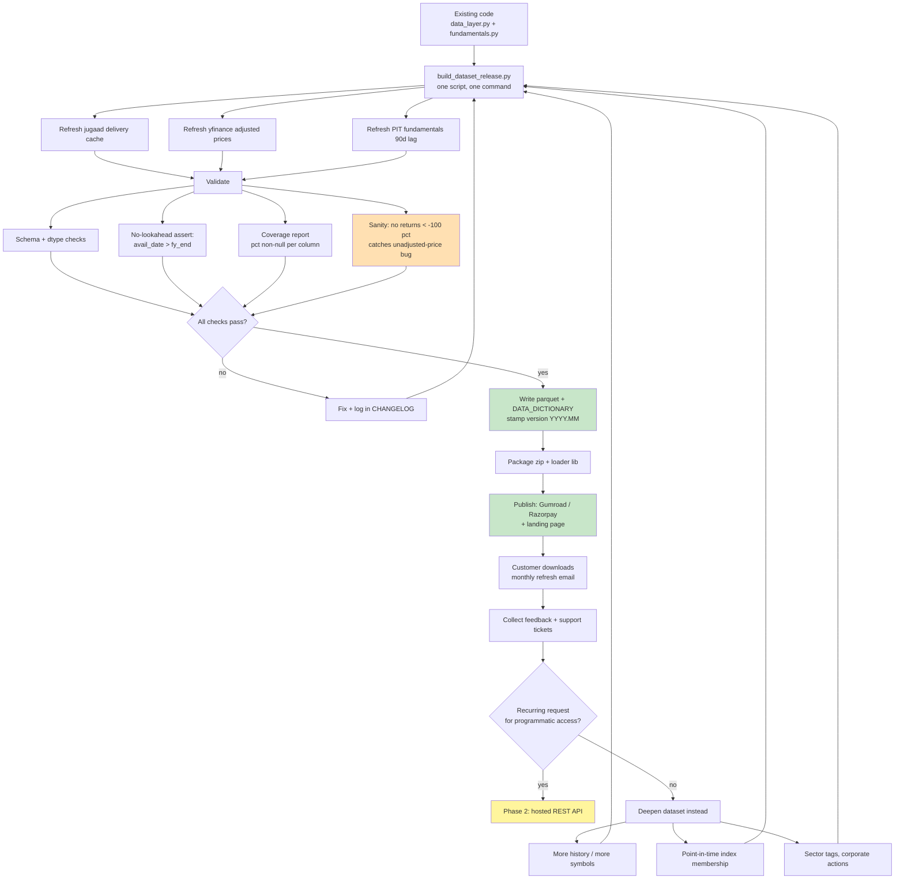

# Data Product Workflow — Gauravi NSE Factor Dataset

_Prepared 2026-08-28. Companion to `MONETIZATION.md` (Tier 1A) and `PROGRESS.md`._

**Product form:** downloadable dataset + thin Python loader library.
**First customer:** retail quants / algo traders.
**Why this form:** no servers, no uptime obligation, no auth or billing plumbing —
fastest path to revenue, and it validates demand before you commit to an API.

---

## 1. What you are actually selling

Not predictions. You are selling **the three problems you already solved**:

| Problem every Indian quant hits | Your solution | Where |
|---|---|---|
| yfinance prices break returns on splits/dividends if misused; jugaad prices are raw/unadjusted | Hybrid: adjusted prices for returns, jugaad for delivery | `data_layer.fetch_hybrid` |
| NSE endpoints rate-limit and fail on bulk history | Parquet cache, fetch once | `data/cache_jugaad/` |
| **Delivery % is not in yfinance at all** and nobody packages it cleanly | Per-symbol delivery panel, date-aligned | `data_layer` |
| Fundamentals leak lookahead if joined naively | 90-day reporting lag + `merge_asof` | `fundamentals.py` |

**The differentiator is delivery %** — as *data*, not as alpha. It is genuinely absent
from every mainstream free source and nobody packages it cleanly at 94% coverage.
Be explicit with buyers: in our own testing delivery-based factors did **not** beat a
plain momentum+reversal model once a date-parsing bug in the delivery source was fixed.
You are selling clean, hard-to-get, correctly-aligned data — not a proven signal.

---

## 2. Package layout

```
gauravi-data/
  data/
    panel_nifty100_5y.parquet    # adjusted OHLC + volume + delivery %
    fundamentals_pit.parquet     # point-in-time, 90d reporting lag
    factors_nifty100.parquet     # precomputed factor values + percentile ranks
    universe.csv                 # symbol list + as-of date
  gauravi_data/
    __init__.py                  # load_panel(), load_fundamentals(), load_factors()
  README.md                      # 1-page quickstart
  example.ipynb                  # reproduce a factor IC table in 20 lines
  CHANGELOG.md
  LICENSE.txt                    # per-seat, no redistribution
  DATA_DICTIONARY.md             # every column, units, caveats
```

**Non-negotiable:** ship `DATA_DICTIONARY.md` documenting that jugaad prices are
unadjusted and must not drive returns. Honesty about data caveats is the whole
brand, and it prevents support tickets.

---

## 3. Build & release workflow



**Automate the monthly refresh from day one** (`build_dataset_release.py` + a cron
or GitHub Action). If the refresh is manual you will skip months, and a stale
dataset kills renewals faster than a missing feature.

---

## 4. Pricing

| Tier | Price | Contents |
|---|---|---|
| Free sample | ₹0 | 10 symbols, 1 year — proves the delivery-% data is real |
| Snapshot | **₹1,500/mo** | Full NIFTY-100, 5y, monthly refresh, 1 seat |
| Bulk + history | **₹25,000/mo** | Full history, all columns, redistribution-free commercial licence |
| One-time archive | ₹15,000 | Single dated snapshot, no updates (for backtest-only buyers) |

Annual prepay at 10 months' price. The free sample is the main conversion lever —
lead with delivery % since that is what they cannot get elsewhere.

---

## 5. Go-to-market for retail quants

They are reachable through content, not sales calls. Publish the work you already did:

1. **"Your NSE backtest is broken and here's the proof"** — the unadjusted-price bug
   that produced an 11% hit-rate. Real, specific, and immediately credible.
2. **"Why your t-stats are 10x too big"** — overlapping-return inflation, with the
   calibrated non-overlap fix.
3. **"Delivery % as a factor"** — publish the actual IC table, including that it is
   not significant. The honesty is the hook.

Channels: r/IndianStreetBets, r/algotrading, Twitter/X quant-India, Zerodha Varsity
forums, LinkedIn. Each post ends with the free sample link, not a hard sell.

**Positioning line:** *"Point-in-time NSE data with delivery %, built by someone who
publishes the negative results too."*

---

## 6. Build checklist (next 30 days)

| # | Task | Effort | Status |
|---|---|---|---|
| 1 | `build_dataset_release.py` — refresh + validate + write parquet, one command | 1 day | **DONE** |
| 2 | Validation suite (the 4 checks in the flow chart, esp. the returns sanity check) | 0.5 day | **DONE** (5 gates) |
| 3 | `gauravi_data` loader lib: `load_panel()`, `load_fundamentals()`, `load_factors()` | 0.5 day | **DONE** |
| 4 | `DATA_DICTIONARY.md` + `README.md` quickstart | 0.5 day | **DONE** (dictionary auto-generated per build) |
| 5 | `example.ipynb` reproducing a factor IC table | 0.5 day | **DONE** |
| 6 | Free 10-symbol sample + landing page + Gumroad/Razorpay | 1 day | sample **DONE** (`--sample`); page + payment open |
| 7 | Monthly refresh automation (GitHub Action) | 0.5 day | **DONE** (`.github/workflows/dataset_release.yml`) |
| 8 | Publish post #1 from section 5 | 0.5 day | open |

~6 working days to first revenue. Remaining blockers are commercial (item 6 payment
+ landing page, item 8 distribution), not technical.

---

## 7. Improvement options kept open

The dataset and the model improve **independently** — shipping data does not freeze
research. Dataset-side roadmap, in value order:

| # | Upgrade | Value to customer | Also helps the model? |
|---|---|---|---|
| 1 | **Point-in-time index membership** | Removes survivorship bias — the #1 thing serious buyers ask for | **Yes** — `PROGRESS.md` step 2 |
| 2 | Extend history beyond 5y | More independent samples | **Yes** — the binding constraint on the 53.1% result |
| 3 | Sector / industry tags | Enables sector-neutral research | Yes — sector-neutral ranking |
| 4 | Corporate-action table (splits, bonus, dividends) | Lets buyers do their own adjustment | Yes — removes yfinance dependence |
| 5 | Quarterly PIT fundamentals (paid source) | Higher-frequency value factors | Yes — largest remaining alpha lever |
| 6 | Intraday / bhavcopy microstructure | New research surface | Unknown |

**Items 1 and 2 are the sweet spot:** they are exactly what buyers demand *and*
exactly what the model needs to resolve 53.1% vs 55%. Build those and both the
product and the research advance on the same work.

> **Guardrail:** the dataset ships descriptive data only — no recommendations, no
> target prices, no "buy" language. That is what keeps this outside SEBI Research
> Analyst territory (see `MONETIZATION.md` §1).
