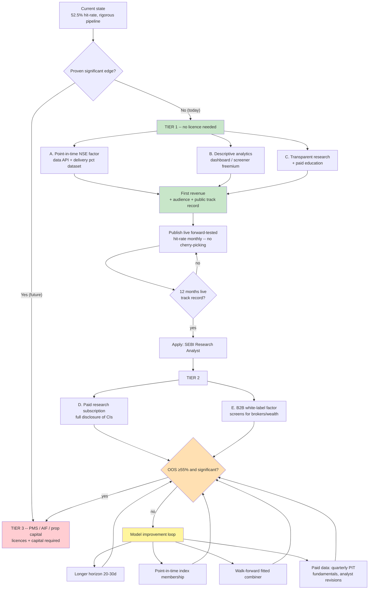

# Monetization Workflow — Gauravi NIFTY-100 Factor Model

_Prepared 2026-08-28. Companion to `PROGRESS.md` (model status & accuracy work)._

> **Not legal or financial advice.** Anything involving stock recommendations or
> client money in India triggers SEBI registration requirements. Confirm the
> specifics with a SEBI-registration consultant / securities lawyer before
> launch.

---

## 0. Honest starting position

| Fact | Implication for monetization |
|---|---|
| Top-quintile hit-rate **52.5%** (from 51.0% baseline) | Real but small. **Not** statistically significant. |
| No individual factor clears 5% significance | Cannot honestly advertise a proven edge. |
| Pipeline is genuinely rigorous: point-in-time data, 90-day reporting lag, calibrated non-overlap t-stats, no lookahead | **This is the sellable asset.** Credibility and method, not alpha. |
| Delivery-% factors (jugaad/NSE bhavcopy) | Genuinely differentiated data almost nobody packages cleanly. |

**Strategic conclusion:** monetize **data, tools, transparency and education first**;
monetize **signals** only after (a) the edge is statistically established and
(b) the correct SEBI registration is in place.

---

## 1. Regulatory gate (India / SEBI)

| Activity | Registration needed | Notes |
|---|---|---|
| Publishing stock recommendations / target prices | **Research Analyst (RA)** | Required even for paid newsletters and Telegram calls. |
| Personalised advice, portfolio advice for a fee | **Investment Adviser (RIA)** | Higher bar; fee-only. |
| Managing client money | PMS / AIF licence | Capital-intensive. Out of scope near-term. |
| Selling **data, analytics, screeners, dashboards, education** | **None** (generally) | Must avoid recommendation framing. This is the low-friction lane. |
| Backtest/factor research published as research, no recommendations | Usually none | Keep it descriptive, not prescriptive. |

**Rule for all copy:** describe *what the data shows*, never *what the user should buy*.
Publish the honest hit-rate (52.5%) and the significance caveat — that disclosure is
both compliance protection and your differentiator.

---

## 2. Revenue streams, ranked by feasibility

### Tier 1 — Ship now (no licence, uses what you already built)

**A. Point-in-time NSE factor data API / dataset** — *highest fit*
- What: clean, cached, survivorship-aware NIFTY-100 panel with **delivery %**,
  factor values, and point-in-time fundamentals. Already 80% built (`data_layer.py`,
  `fundamentals.py`).
- Why it sells: quants and algo traders waste weeks fighting yfinance adjustment
  bugs and NSE rate limits — the exact problems you already solved (see the
  unadjusted-price bug in `PROGRESS.md`).
- Pricing: ₹1,500–5,000/mo per seat; ₹25k+/mo for API/bulk.
- Effort: low. Package the parquet cache + a documented fetch API.

**B. Analytics dashboard / screener (descriptive, not advisory)**
- Factor percentile ranks, delivery-% heatmaps, quintile spread charts.
- Freemium: free delayed view, paid live + history + export.
- Pricing: ₹499–999/mo retail.

**C. Transparent research + education**
- Publish the honest methodology: why naive t-stats inflate 10x, why unadjusted
  prices break backtests, how to build point-in-time panels.
- Monetize via: paid course/cohort (₹5k–15k), sponsorships, book/newsletter.
- Strategic value: builds the credibility that Tier 2/3 depends on.

### Tier 2 — After SEBI RA registration

**D. Paid research subscription** — weekly ranking report with full disclosure
of hit-rate and confidence intervals. Pricing ₹999–2,999/mo.
**E. White-label factor screens for brokers / wealth platforms** — B2B licensing,
₹50k–3L/mo. Requires the track record from Tier 1.

### Tier 3 — Only after a statistically established edge

**F. PMS / AIF / prop capital.** Do **not** attempt at 52.5% non-significant.
Requires licences, capital, and a real edge. Revisit only if Phase 2/3 in
`PROGRESS.md` clears 55% out-of-sample with significance.

---

## 3. Monetization workflow

**Critical sequencing insight:** Tier 1 revenue does not depend on the model
being good. It depends on the *data and method* being good — which they already
are. That funds and de-risks the model improvement work, instead of the model
improvement work blocking all revenue.

---

## 4. Model improvement roadmap (kept open)

Monetization does **not** freeze the model. Improvement continues in parallel;
each item below is independent and can be picked up in any order.

| # | Improvement | Cost | Expected gain | Status |
|---|---|---|---|---|
| 1 | **Longer horizon (20–30d)** — accuracy generally rises with holding period | Very low (data cached) | Best cheap shot at 55% | **Next** |
| 2 | Fix `^NSEI` benchmark in jugaad path | Very low | Correctness, not accuracy | Open |
| 3 | **Point-in-time NIFTY-100 membership** — removes survivorship bias | Medium | Makes numbers *honest*; may lower them | Open |
| 4 | Locked 12-month holdout, scored once | Low | Credibility for Tier 2 | Open |
| 5 | **Walk-forward fitted combiner** (XGBoost/ridge) replacing equal weights | Medium | Modest, real | Open |
| 6 | FII/DII as **regime exposure overlay** (not a ranking factor) | Low | Drawdown control > accuracy | Open |
| 7 | Sector-neutral ranking | Low | Reduces sector-bet noise | Idea |
| 8 | Paid PIT data: quarterly fundamentals, analyst revisions | High (₹) | Largest remaining lever | Gated on revenue |
| 9 | Intraday/microstructure signals from bhavcopy | High | Unknown | Idea |

**Guardrail:** never re-tune on the holdout. If an improvement fails out-of-sample,
record the negative result in `PROGRESS.md` and move on — the honest negative log
is itself a credibility asset for the research product.

---

## 5. Immediate action list (next 30 days)

1. Test the **20–30 day horizon** (improvement #1) — decides whether 55% is reachable.
2. Package the **data layer as a product**: documented API, sample notebook, pricing page (Tier 1A).
3. Start **publishing forward-tested results monthly** — begins the 12-month track record clock now, since that clock gates everything in Tier 2.
4. Draft compliance-safe copy: descriptive language only, hit-rate and CI disclosed.
5. Consult a SEBI-registration advisor on the RA timeline so registration runs in parallel with the track record.

**Do first, because it is on the critical path of everything else:** item 3.
The track record cannot be backdated.
