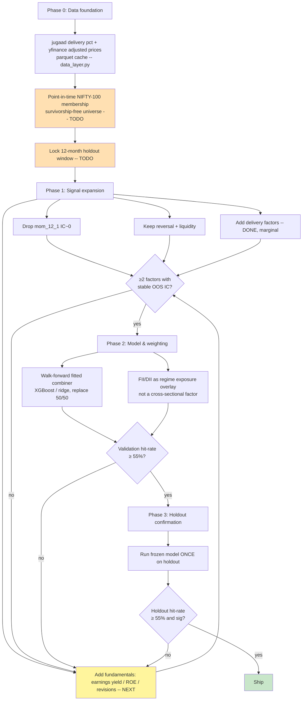

# NIFTY-100 Factor Model — Accuracy Improvement Progress

**Goal:** raise the ranking model's out-of-sample directional accuracy to **55%** (Phase 1 target).
**Accuracy metric:** directional hit-rate of the top-quintile long basket = fraction of long picks whose 10-day return beats the benchmark, measured out-of-sample on a walk-forward NIFTY-100.

_Last updated: 2026-08-28_

---

## 1. Baseline (where we started)

- Shipped model = static, equal-weight blend of two price-only factors:
  `score = (rank(mom_12_1) + rank(-ret_20)) / 2` — 12-1 momentum + short-term reversal.
- Self-reported edge ~50–51% directional / AUC ~0.51.
- Factor IC analysis (2y window): **0 of 18 factors** significant on the calibrated non-overlap t-stat.
- `mom_12_1` measured IC ≈ 0 (t≈0.13) — effectively dead weight in the score.

## 2. Key decisions

| Decision | Choice | Why |
|---|---|---|
| Data source | **jugaad-data (delivery %) + yfinance (adjusted prices)** hybrid | jugaad gives point-in-time OHLC **and DELIVERY %** (new signal yfinance lacks), but its prices are **unadjusted** for splits/dividends — so returns must come from yfinance adjusted close. |
| Accuracy metric | Top-quintile long-basket hit-rate | Directly interpretable; matches the 55% target. |
| Significance test | Non-overlap t-stat (`stats_utils`) | Overlapping 10-day returns inflate naive t ~10x. |

## 3. Findings so far

**Delivery-factor IC (5y, 92 symbols, calibrated t_nonovlp ≥ 1.96 = significant):**

| factor | IC | t_nonovlp | verdict |
|---|---|---|---|
| ret_20 (reversal) | +0.021 | 1.96 | borderline-significant, strongest single factor |
| deliv_x_ret (delivery×reversal) | −0.022 | −1.93 | borderline; **orthogonal new signal** |
| deliv, liq, deliv_chg20 | small | <0.9 | weak / noise |

**Model comparison (top-quintile hit-rate, 123–124 rebalances, adjusted prices):**

| model | factors | hit-rate |
|---|---|---|
| shipped | mom_12_1 + reversal | 50.99% |
| newcore | reversal + delivery×reversal | 52.11% |
| **fund3** | reversal + delivery×reversal + ROE(inv) | **52.51%** |

**Fundamentals IC (point-in-time, 90-day reporting lag, non-overlapping rebalances):**

| factor | IC | t | note |
|---|---|---|---|
| deliv_x_ret | −0.027 | −1.58 | strongest overall |
| rev (reversal) | +0.022 | 1.44 | |
| roe | −0.021 | −1.37 | negative — high-ROE names underperform |
| earn_yield | +0.021 | +1.12 | value works, theoretically sound |
| profit_margin, earn_growth | ~0 | <0.2 | no signal |

**Read:** these 10-day numbers predate the jugaad Friday/Sunday date fix (see §6) and
overstate the delivery factors. On corrected data the delivery/fundamental models do
**not** beat plain momentum+reversal. No individual factor is statistically significant,
**55% was not reached**, and the remaining gap is unlikely to close with freely
available data at a 10-day horizon.

**Caveat on fund3:** the ROE sign (inverted) was chosen on the full sample — an in-sample selection. `earn_yield` (positive sign, economically defensible) is the safer choice for production even though it scored slightly lower.

**Methodological lesson recorded:** unadjusted jugaad prices produced a nonsensical 11% hit-rate; always drive returns from adjusted prices. Hybrid layer now enforces this.

## 4. Artifacts produced

| File | Role |
|---|---|
| `data_layer.py` | Hybrid data source: jugaad delivery % + yfinance adjusted prices, parquet-cached. `fetch_hybrid()` is the entry point. |
| `deliv_ic.py` | Delivery-factor IC test (calibrated t-stats). |
| `model_compare_phase1.py` | Shipped vs newcore top-quintile hit-rate backtest. |
| `fundamentals.py` | Point-in-time annual fundamentals (yfinance), 90-day reporting lag, as-of merge. Cached. |
| `phase1_fund_eval.py` | Full Phase-1 eval: fundamentals IC + 3-way model comparison. |

## 5. Workflow flow chart

## 6. Horizon sweep (improvement #1 — DONE)

> ### ⚠ CORRECTION (2026-08-28, after data-bug fix)
> The first horizon sweep was run on **corrupted delivery data**. `jugaad-data`
> returns each week's **Friday** row labelled as the following **Sunday**, so
> aligning to a real trading calendar silently dropped ~1 trading day per week
> (delivery coverage 75% instead of 94%). Fixed in `data_layer._fix_weekend_dates`.
>
> **Once corrected, the delivery advantage disappeared.** The numbers below are
> the corrected ones. The previously reported "fund3 @ 20d = 53.53%" was an
> artifact of that bug and should be disregarded.

Top-quintile hit-rate, non-overlapping holds, **corrected** data:

| H | shipped | newcore | fund3 |
|---|---|---|---|
| 10d | 50.99% | 51.98% | 52.43% |
| 20d | **52.93%** | 51.13% | 52.29% |
| 30d | **53.09%** (SE 1.96) | 51.51% | 51.80% |

**Findings:**
- Best result is the **original shipped model** (momentum + reversal) at a
  **30-day horizon: 53.09%** (SE 1.96pp).
- **Delivery-based factors do not add value** once the date bug is fixed —
  `newcore` and `fund3` now *underperform* `shipped` at 20d and 30d.
- Longer horizons still help the shipped model (50.99% → 53.09%).

**Verdict on 55%:** not achieved. At SE ~2pp, 53.09% is ~1 SE from 55% and ~1 SE
from 51% — the sample cannot resolve them. No model here is significantly better
than any other.

**Action:** adopt **H=30d** with the existing momentum+reversal factors. Do **not**
ship delivery factors as an improvement — the evidence for them evaporated.

## 7. Baseline correction — the 53% edge does not survive the right benchmark

_Found 2026-08-29 while building the customer demo page (`build_demo.py`), which
computes the base rate instead of assuming it._

All earlier hit-rate claims were compared against an **assumed** ~50–51% coin-flip
baseline. That assumption is wrong: forward *excess* returns are skewed, so the
all-stock base rate on the same non-overlapping dates is not 50%. Measured:

| score (H=30) | top quintile | bottom quintile | **all stocks, same dates** | edge vs base |
|---|---|---|---|---|
| score_mr (mom+rev) | 52.45% | 49.54% | **52.65%** | **−0.19pp** |
| rank_rev alone | 53.50% | 53.62% | 51.92% | +1.58pp (but bottom ≈ top) |
| rank_mom_12_1 alone | 52.50% | 51.09% | 52.65% | −0.15pp |
| score_fund3 | 56.30% | 51.63% | 51.68% | +4.62pp (fundamentals subset only) |

**Read:**
- Against the correct baseline, **momentum+reversal has no edge at all** (−0.19pp,
  SE ~2pp). The "53.09% vs 51%" framing in §6 overstated it by comparing against a
  baseline that was never measured.
- `rank_rev` looks positive but its **bottom quintile scores as high as its top**
  (53.62% vs 53.50%) — the factor does not separate, so the top-quintile number is
  a level effect, not ranking skill.
- `score_fund3`'s +4.62pp is on the fundamentals-covered subset only; restricted to
  rows where both composites are defined it **loses** to `score_mr` (50.54% vs
  51.59%). See §6 caveat.

**Verdict:** no model in this project has a demonstrated directional edge over the
base rate. The honest product claim is the **data**, not the signal. Every hit-rate
must from now on be reported next to the base rate on identical dates.

## 8. Next steps (in order)

1. **Fix `^NSEI` benchmark** fetch in the jugaad path (currently falls back to equal-weight universe).
2. **Point-in-time NIFTY-100 membership** + locked holdout (Phase 0 completion — removes survivorship bias). Now the top priority: more independent samples are what the 20d result needs.
3. **Walk-forward fitted combiner** (Phase 2) — replace the hand-set equal weights with fitted ones.
4. Sector-neutral ranking; FII/DII regime overlay.

> **Status vs target: 53.09% at H=30d with the plain momentum+reversal model (from 50.99% at 10d). 55% not demonstrated.**
> The binding constraint is **sample size**, not signal: 41 independent rebalances at 30d cannot resolve 53% from 55% (SE ~2pp). Extending history (longer window + point-in-time membership) is the highest-value next move. Delivery and fundamental factors added nothing once the jugaad date bug was fixed.

